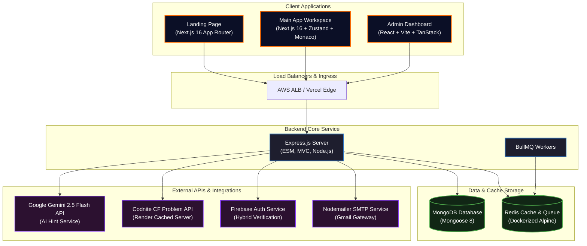
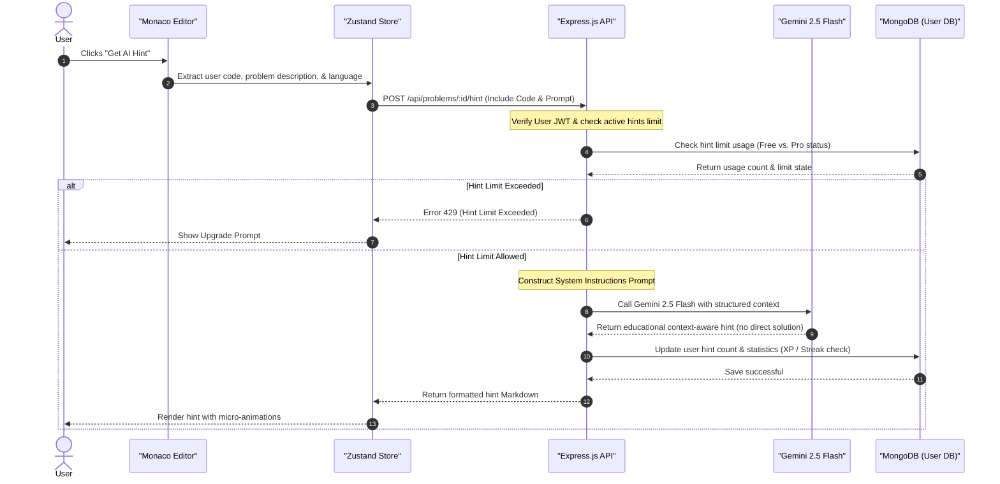
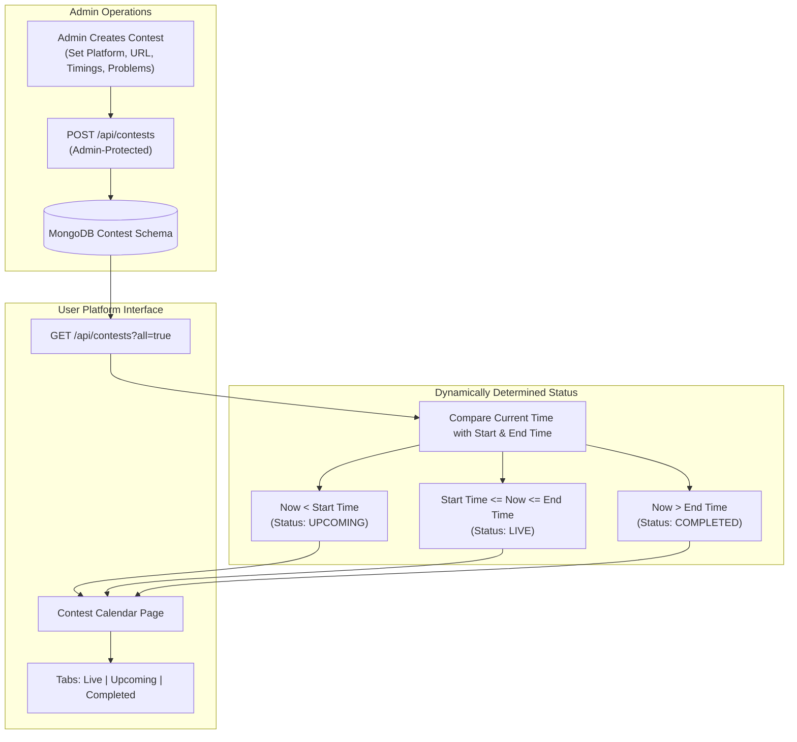
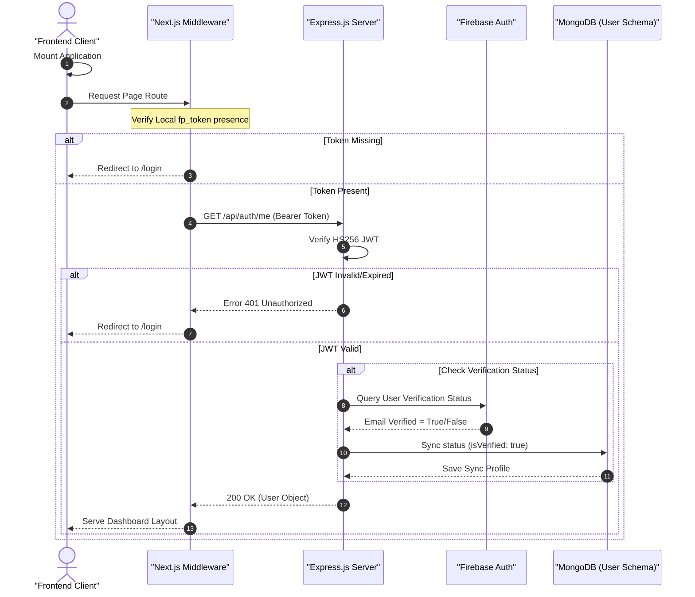

<!-- HERO SECTION -->
<div align="center">
  <br />
  
  
  # **FullPrep Platform**
  
  **`The Enterprise-Grade Competitive Programming & DSA Learning Sandbox`**
  
  <p align="center">
    A complete competitive programming ecosystem featuring a modern Next.js 16 frontend, an Express MVC backend, a containerized Redis/MongoDB caching layer, a dedicated React Admin dashboard, and a pixel-perfect Next.js marketing landing page. Fully integrated with Gemini 2.5 Flash AI tutoring.
  </p>

  <br />

  <!-- SERVICE STATUS BADGES -->
  <p align="center">
    <a href="https://fullprep.vercel.app" target="_blank"></a>
    <a href="https://fullprep-home.vercel.app" target="_blank"></a>
    <a href="https://fullprep-admin.vercel.app" target="_blank"></a>
    <a href="https://fullprep-frontend-mirror.onrender.com/health" target="_blank"></a>
  </p>

  <!-- TECH STACK BADGES -->
  <p align="center">
    
    
    
    
    
    
    
    
    
  </p>


</div>

---

## 📖 Table of Contents

- [✨ Core Features](#-core-features)
- [🏗️ System Architecture](#️-system-architecture)
- [📁 Repository Structure](#-repository-structure)
- [⚙️ Key Workflows](#️-key-workflows)
  - [AI Tutor Hint Workflow](#ai-tutor-hint-workflow)
  - [Contest Lifecycle Sync](#contest-lifecycle-sync)
  - [Hybrid Authentication Sync](#hybrid-authentication-sync)
- [🛠️ Getting Started](#️-getting-started)
- [📊 Configuration (Environment Variables)](#-configuration-environment-variables)
- [🔌 API Overview](#-api-overview)
- [📸 Application Gallery](#-application-gallery)
- [🐳 Containerization & DevOps](#-containerization--devops)
- [🧪 Testing Suite](#-testing-suite)
- [🚀 Roadmap & Milestones](#-roadmap--milestones)
- [🤝 Contributing](#-contributing)
- [👥 Authors](#-authors)

---

## ✨ Core Features

> [!NOTE]
> FullPrep combines traditional online judge capabilities with advanced AI guidance to deliver an optimized preparation experience for coding interviews and competitive programming.

### 🌟 Core Ecosystem Features
| Feature | Details | Primary Technologies |
| :--- | :--- | :--- |
| **🤖 Gemini AI Tutor** | Context-aware hints generated from user code submission states. Features configurable rate limits (Free vs Pro). | `Google Gemini 2.5 Flash`, `Node.js SDK` |
| **💻 Code Workspace** | Seamless Monaco Editor sandbox environment with full stdin/stdout execution support. | `Monaco Editor`, `Zustand State`, `Docker` |
| **📅 Contest Calendar** | Unified contest schedule with automatic date-relative status filters (`Live`, `Upcoming`, `Completed`). | `TanStack Query`, `Mongoose` |
| **🛡️ Admin Command Center** | Advanced CRUD management dashboards to create/edit problems, contests, and users, and view platform health. | `React + Vite SPA`, `TanStack Router` |
| **📈 Dynamic Analytics** | Comprehensive student analytics charting developer level progression, total XP, and streak telemetry. | `Recharts`, `Zustand Stores` |
| **🏆 Social Leaderboard** | Advanced user sorting system queryable by country, timeframe, and platform parameters. | `Express API`, `Zustand` |
| **🔐 Secure Auth System** | Dual auth mechanism using JWT Bearer headers + httpOnly cookie fallbacks with Firebase-backed email verification. | `Firebase Admin SDK`, `JWT` |

---

## 🏗️ System Architecture

FullPrep is designed as an decoupled monorepo composed of autonomous frontend clients, a centralized middleware gateway, an Express.js API, and a containerized data caching layer.



### Monorepo Core Services Matrix
| Service | Location | Port | Framework / Tech Stack | Hosting Platform |
| :--- | :--- | :--- | :--- | :--- |
| **`landing-page`** | [landing-page/](file:///d:/Projects/fullprep-mirror/landing-page) | `3001` | Next.js 16, TailwindCSS v4, Framer Motion | Vercel |
| **`frontend`** | [frontend/](file:///d:/Projects/fullprep-mirror/frontend) | `3000` | Next.js 16.2.6 (App Router), Zustand, Monaco, Recharts | Vercel |
| **`fullprep-Admin`** | [fullprep-Admin/](file:///d:/Projects/fullprep-mirror/fullprep-Admin) | `5173` | React 18, Vite, TanStack Router & Query | Vercel |
| **`backend`** | [backend/](file:///d:/Projects/fullprep-mirror/backend) | `5000` | Node.js, Express.js (ESM), Mongoose 8, BullMQ | Render / AWS ECS |

---

## 📁 Repository Structure

```
fullprep-mirror/
├── backend/                   # Express.js REST API (MVC, Mongoose, Gemini AI, BullMQ)
│   ├── src/
│   │   ├── controllers/       # Route controllers (auth, stats, problems, contests, AI, etc.)
│   │   ├── models/            # Mongoose schemas (User, Problem, Contest, Submission, …)
│   │   ├── routes/            # Express route definitions
│   │   └── utils/             # Helpers (Gemini service, Codnite client, JWT, etc.)
│   ├── server.js              # Entrypoint server (database & server initializations)
│   └── seed.js                # Codnite Problem API seeding script
├── frontend/                  # Main Web Application client (Next.js 16 App Router)
│   ├── app/                   # Dynamic views (auth, dashboard, public)
│   ├── components/            # Layout components (editor, auth, UI primitives)
│   ├── services/              # API wrapper services (DIP-compliant client)
│   ├── store/                 # Zustand state stores (editor, auth, notifications)
│   └── docs/                  # Architecture & State management documentation
├── fullprep-Admin/            # Admin Panel Client (React + Vite SPA)
│   ├── src/
│   │   ├── routes/            # TanStack file-based routing views
│   │   └── lib/               # TanStack query clients & API endpoints wrapper
│   └── index.html             # Vite wrapper entry point
├── landing-page/              # Marketing Landing Page (Next.js 16 + Tailwind v4)
│   ├── app/                   # Public landing layout config
│   └── components/            # Interactive visual components (Bento grid, Floating IDE)
└── devops/                    # Orchestration, CI/CD, & Cloud Infrastructure
    ├── .github/workflows/     # CI/CD pipelines (7-stage integration tests & deployment)
    ├── aws/                   # Terraform infra & ECS task configurations
    ├── kubernetes/            # K8s manifest files (deployments, services)
    └── scripts/               # Automation control scripts (build, run, cleanup)
```

---

## ⚙️ Key Workflows

### AI Tutor Hint Workflow
Visual flow representing the step-by-step logic when a student requests an AI-generated hint in the Monaco Workspace.



### Contest Lifecycle Sync
How contests are generated inside the Admin Panel and synced downstream in real time onto the student dashboard calendar.



### Hybrid Authentication Sync
Sequence demonstrating authentication flow syncing JWT structures with Firebase Auth verification steps.



---

## 🛠️ Getting Started

### Prerequisites
- **Node.js**: v18 or higher (LTS recommended)
- **MongoDB**: Local server (`mongodb://localhost:27017`) or Atlas URI
- **Redis**: Port `6379` running locally or via Docker
- **Gemini API Key**: Google Developer console key for Gemini API integration

### Local Setup Instructions

```bash
# Clone the repository
git clone https://github.com/shaddy-pv/fullprep-mirror.git
cd fullprep-mirror
```

<details>
<summary><b>Step 1: Backend API Configuration</b></summary>

```bash
cd backend
npm install

# Copy environment template
cp .env.example .env
# Edit .env and populate MONGO_URI, JWT_SECRET, and GEMINI_API_KEY

# Seed problems dataset from Codnite CF Problem API (282 Problems)
npm run seed

# Run local Express development server
npm run dev # Launches http://localhost:5000
```
</details>

<details>
<summary><b>Step 2: Main Next.js Frontend Configuration</b></summary>

```bash
cd ../frontend
npm install

# Copy environment template
cp .env.local.example .env.local
# Verify NEXT_PUBLIC_API_BASE_URL=http://localhost:5000/api

# Run local Next.js client
npm run dev # Launches http://localhost:3000
```
</details>

<details>
<summary><b>Step 3: React Admin Dashboard Configuration</b></summary>

```bash
cd ../fullprep-Admin
npm install

# Create environment configuration
echo "VITE_API_BASE_URL=http://localhost:5000/api" > .env

# Run local Vite server
npm run dev # Launches http://localhost:5173
```
</details>

<details>
<summary><b>Step 4: Landing Page Configuration</b></summary>

```bash
cd ../landing-page
npm install

# Run marketing landing page locally
npm run dev # Launches http://localhost:3001
```
</details>

---

## 📊 Configuration (Environment Variables)

A unified index of all configurations required across backend and client monorepo services:

### Backend Service (`backend/.env`)
| Variable Name | Required | Default Value | Description |
| :--- | :---: | :--- | :--- |
| `PORT` | Yes | `5000` | Express HTTP server port. |
| `NODE_ENV` | Yes | `development` | Runtime environment. |
| `MONGO_URI` | Yes | `mongodb://localhost:27017/fullprep` | Connection string for MongoDB database instance. |
| `JWT_SECRET` | Yes | — | Key for signing HS256 JWT tokens. |
| `JWT_EXPIRES_IN` | No | `7d` | Token expiry duration. |
| `ALLOWED_ORIGINS`| Yes | `http://localhost:3000,http://localhost:5173` | Allowed CORS client origins. |
| `FIREBASE_PROJECT_ID`| Yes | — | Firebase Project ID for hybrid email verification. |
| `FIREBASE_CLIENT_EMAIL`| Yes| — | Client Email of Firebase service account. |
| `FIREBASE_PRIVATE_KEY`| Yes| — | Private Key of Firebase service account. |
| `SMTP_USER` | No | — | Gmail SMTP email address for Nodemailer setup. |
| `SMTP_PASS` | No | — | App-specific password for SMTP server. |
| `CODNITE_API_URL` | Yes | `https://codnite-problem-api.onrender.com` | Base URL for remote Codnite Problem API database. |
| `GEMINI_API_KEY` | Yes | — | Google API Key for AI Tutor features. |

### Frontend & Admin Services
| Location | Variable Name | Required | Default Value | Description |
| :--- | :--- | :---: | :--- | :--- |
| `frontend` | `NEXT_PUBLIC_API_BASE_URL` | Yes | `http://localhost:5000/api` | Direct API endpoint connection wrapper. |
| `frontend` | `NEXT_PUBLIC_APP_ENV` | No | `development` | Environment check for Next.js. |
| `admin` | `VITE_API_BASE_URL` | Yes | `http://localhost:5000/api` | Admin panel backend endpoint identifier. |

---

## 🔌 API Overview

### Authentication Endpoint (`/api/auth`)
| Method | Endpoint | Auth | Parameters | Description |
| :--- | :--- | :---: | :--- | :--- |
| `POST` | `/register` | Public | `{ name, email, password }` | Register a new user profile. |
| `POST` | `/login` | Public | `{ email, password }` | Authenticate user and receive JWT. |
| `POST` | `/logout` | Public | — | Terminate session and clear cookie state. |
| `GET` | `/me` | JWT | — | Fetch profile details of authenticated user. |
| `PATCH`| `/update-profile` | JWT | `{ name, bio, avatar, socialLinks }` | Modify user account metrics. |
| `POST` | `/resend-verification` | JWT | — | Push NodeMailer verification link. |
| `POST` | `/sync-verification` | JWT | — | Query Firebase verification and sync to MongoDB. |

### Problems Endpoint (`/api/problems`)
| Method | Endpoint | Auth | Parameters | Description |
| :--- | :--- | :---: | :--- | :--- |
| `GET` | `/` | Public | `page`, `limit`, `difficulty`, `tag`, `search` | Fetch paginated, cached problems. |
| `GET` | `/:id` | Public | `:id` (problem externalId) | Fetch complete description and test cases. |
| `GET` | `/:id/tests`| Public | `:id` (problem externalId) | Return public input/output test array. |
| `GET` | `/search` | Public | `q` (search query value) | Search problems by title. |
| `GET` | `/random` | Public | `difficulty`, `tag` | Retrieve random filtered problem. |
| `GET` | `/tags` | Public | — | Fetch list of problem tags with count details. |
| `GET` | `/stats` | Public | — | Return counts grouped by level classification. |
| `POST` | `/sync` | Admin | `{ forceAll }` | Bulk sync 282 problems from Codnite API. |
| `POST` | `/` | Admin | `{ problemSchema }` | Create a custom coding problem. |
| `PATCH`| `/:id` | Admin | `{ problemSchema }` | Edit fields of existing problem. |
| `DELETE`| `/:id` | Admin | — | Soft-delete a problem (`isActive: false`). |

---

## 📸 Application Gallery

### 💻 Student Platform & Workspace
| Main Dashboard | Coding Workspace |
| :---: | :---: |
| <br/>*Interactive analytics overview showing XP, streak, and recent submissions.* | <br/>*Monaco Editor integration with live coding execution & Gemini AI Tutor.* |

| Global Leaderboard | Profile & Analytics |
| :---: | :---: |
| <br/>*Social ranking board with country, platform, and date-range filters.* | <br/>*User profile highlighting personal statistics, performance charts, and level progress.* |

### 🚀 Marketing Landing Page
| Hero Section (Dark Mode) | Features Layout (Light Mode) |
| :---: | :---: |
| <br/>*Modern midnight-navy hero container featuring static mockups and neon orange accents.* | <br/>*Clean SaaS features list displaying platform capabilities with strict a11y labels.* |

| Bento Dashboard (Dark Mode) | Contact Form (Light Mode) |
| :---: | :---: |
| <br/>*A custom Bento Grid displaying active coding metrics and visual heatmaps.* | <br/>*Clean responsive contact form containing custom-drawn SVG indicators.* |

---

## 🐳 Containerization & DevOps

The DevOps orchestration config resides in the [devops/](file:///d:/Projects/fullprep-mirror/devops) directory.

### Docker Local Orchestration
The monorepo uses multi-stage optimized builds to decrease deployment sizing constraints.

```bash
# Start all containerized services (Next.js, Express, MongoDB, Redis)
docker-compose up --build -d

# Check runtime docker logs
docker-compose logs -f

# Spin down active container containers
docker-compose down
```

### AWS ECS Architecture & Infrastructure as Code
Deploy infrastructure using **Terraform** scripts located in [devops/aws/terraform/](file:///d:/Projects/fullprep-mirror/devops/aws/terraform).

```
[ Internet ] ──> [ ALB (Application Load Balancer) ]
                       │
             ┌─────────┴─────────┐
             ▼                   ▼
      [ ECS Fargate ]     [ ECS Fargate ]
      Frontend Service    Backend Service
             │                   │
             │         ┌─────────┴─────────┐
             │         ▼                   ▼
             │    [ DocumentDB ]     [ ElastiCache ]
             │    (MongoDB Comp)      (Redis Cache)
             │
             └─> AWS CloudWatch (Logging & Performance Dashboards)
```

```bash
cd devops/aws/terraform
terraform init
terraform plan
terraform apply
```

---

## 🧪 Testing Suite

Automated verification pipelines ensure platform integrity across all modules.

### Interactive API Testing (Swagger & Postman)
The backend features an automatically generated **OpenAPI / Swagger documentation** interface that serves as a live testing ground for all 80+ endpoints.
- **Swagger UI**: Accessible at `http://localhost:5000/api-docs` when the backend is running.
- **Postman Import**: You can instantly import all 80+ pre-configured requests into Postman by importing via link: `http://localhost:5000/api-docs.json`.
- For detailed setup, see the [Postman Testing Guide](testing/postman_guide.md) and [Swagger Testing Guide](testing/swagger_testing_guide.md).

### Automated Testing

```bash
# Validate frontend TypeScript compilation types
cd frontend && npm run type-check

# Audit code quality syntax using ESLint
cd frontend && npm run lint

# Run backend automated integration tests (Jest)
cd backend && npm test

# Run E2E integrations tests via Playwright (requires servers running)
cd frontend && npm run test:e2e
```

### GitHub Actions CI/CD Pipeline
Every pull request triggers our 7-stage automated quality assurance pipeline:

```
[ Lint / Code Quality ] ──> [ Security Scan ] ──> [ Build Verification ]
                                                         │
                                                         ▼
[ Health Validation ] <── [ Post-Deploy Checks ] <── [ ECS AWS Deploy ]
      │
      └──> [ Slack Alarm Status Notification ]
```

---

## 🚀 Roadmap & Milestones

- [x] Integrate **Monaco Code Workspace** with compiler support.
- [x] Configure **Gemini 2.5 Flash** contextual API for tutor features.
- [x] Complete **Contest Calendar** layout linked with Express database entries.
- [x] Implement **TanStack File-Based routing** in the Admin panel.
- [ ] Incorporate **Grafana Dashboard** configurations for real-time monitoring.
- [ ] Setup vulnerability scanning using **Trivy** or **Snyk**.
- [ ] Build auto-rotation schedules in **AWS Secrets Manager**.

---

## 🤝 Contributing

1. Create a workspace feature branch: `git checkout -b feat/your-feature-name`.
2. Commit your code modifications. Ensure all code formatters align with repository standards.
3. Validate tests pass locally: `npm run lint` and `npm run test`.
4. Open a pull request against `main`. All CI checks must pass green ✅ before review.

---

## 👥 Authors

- **Shivam** — Full-Stack Developer & Backend Lead ([@shaddy-pv](https://github.com/shaddy-pv)) — *Payments, Judge Engines, Express API*
- **Khushi** — Frontend Developer, UI/UX & Testing — *Next.js Dashboard, Custom Accent Engine, Playwright Tests*
- **Md. Shadan** — DevOps & Full-Stack Developer — *Docker Configurations, CI/CD Pipeline, MongoDB Indexing*

---

<div align="center">
  <sub>Built with ❤️ by the FullPrep Team.</sub>
</div>
