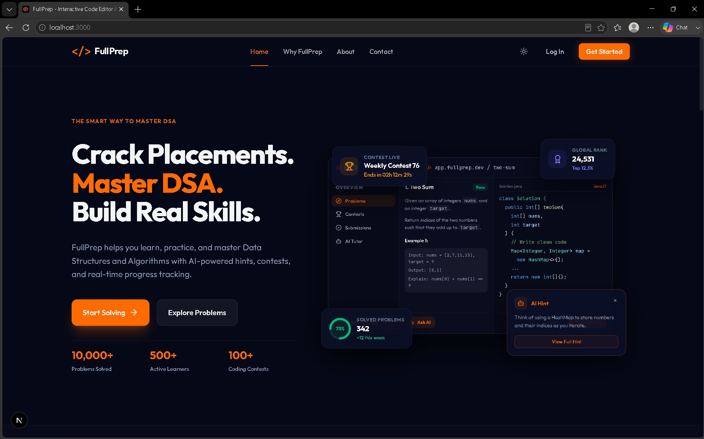
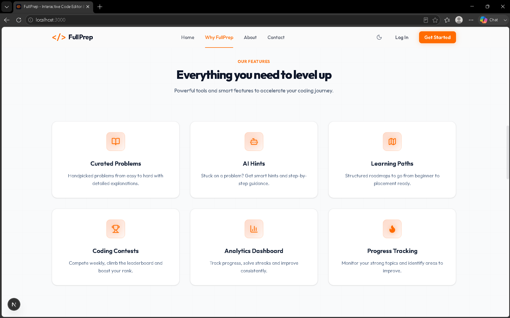
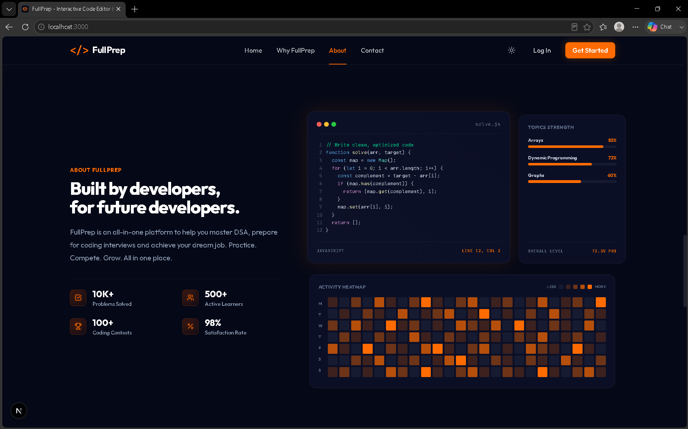
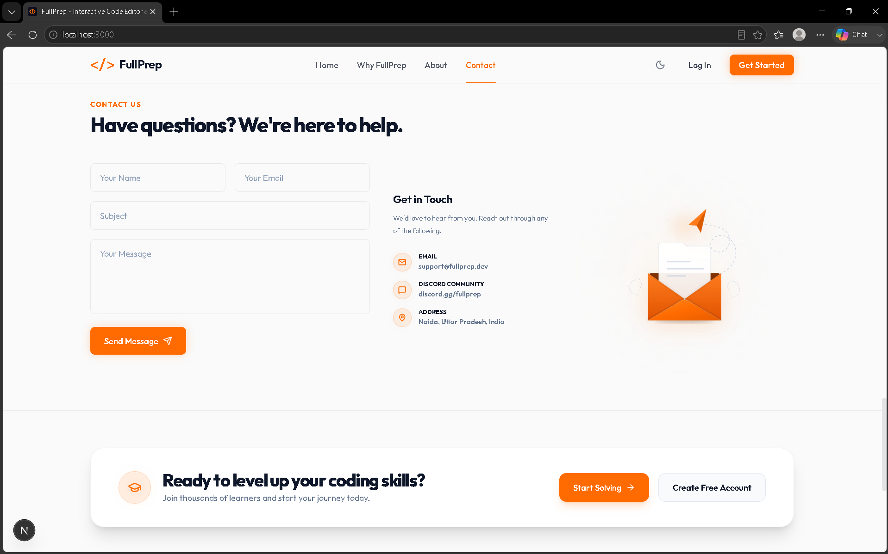

<!-- FULLPREP README — Terminal × Pixel Aesthetic -->

<div align="center">
  <br />
  
  <br />
  <br />

  # **FULLPREP**

  **`The Smart Way to Master DSA`**

  *A premium, production-ready landing page for an AI-powered DSA learning & interview prep platform.*

  ---

  [](https://nextjs.org)
  [](https://www.typescriptlang.org)
  [](https://tailwindcss.com)
  [](https://www.framer.com/motion)
  [](LICENSE)

</div>

---

## `> SCREENSHOTS`

| Hero — Dark Mode | Features — Light Mode |
|:---:|:---:|
|  |  |

| Dashboard — Dark Mode | Contact — Light Mode |
|:---:|:---:|
|  |  |

> **`📁`** Drop your `PNG` / `JPG` screenshots into the [`screenshots/`](screenshots/) folder using the filenames above — they auto-render here.

---

## `> FEATURES`

```
┌─────────────────────────────────────────────────────────────────┐
│  DESIGN SYSTEM                                                  │
│  ▸ Deep midnight navy   #050816  ← dark canvas                 │
│  ▸ Premium SaaS grey   #FAFAFA  ← light canvas                 │
│  ▸ Orange accent        #FF6B00  ← buttons, glows, borders     │
└─────────────────────────────────────────────────────────────────┘
```

| Symbol | Feature |
|--------|---------|
| `🎨` | **Premium Design System** — Midnight navy dark mode + SaaS grey light mode with a unified `#FF6B00` accent |
| `🔍` | **SEO-Ready Semantic HTML** — `<header>` `<main>` `<section>` `<footer>` with `aria-labelledby` on every bento widget |
| `📐` | **Strict Heading Hierarchy** — One `<h1>` (Hero), `<h2>` (sections), `<h3>` (cards) — perfect crawler outline |
| `🏷️` | **Next.js Metadata API** — OpenGraph + Twitter cards with alt-text, high-intent keywords baked in |
| `🌓` | **Dark / Light Mode** — Class-based Tailwind v4 toggle via `next-themes` |
| `🛡️` | **Hydration Mismatch Shield** — Mounting guards prevent SSR/CSR theme flicker |
| `⚙️` | **100% Strict TypeScript** — Zero `any` types across all components and config |
| `⚡` | **Framer Motion Animations** — Spring nav underline, `whileTap` card physics, staggered viewport reveals |
| `🧩` | **Bento Grid Dashboard** — Live code editor mockup, Topics Strength bars, GitHub-style Activity Heatmap |
| `🤖` | **Hero IDE Mockup** — Floating contest / rank / solved / AI-hint widgets with micro-interactions |
| `💥` | **6-Card Features Grid** — Curated Problems, AI Hints, Learning Paths, Contests, Analytics, Progress Tracking |
| `✉️` | **Animated Contact Section** — Paper-plane SVG with theme-aware paths and proper a11y `<title>` tags |
| `🏆` | **Pre-Footer CTA** — Graduation cap badge with brand-orange glow and high-contrast type |
| `🐦` | **X (Twitter) Icon** — Updated to official X Corp logo |

---

## `> FILE TREE`

```
fullprep-landing-page/
│
├── app/
│   ├── layout.tsx          ← Root layout: ThemeProvider + grid background
│   ├── page.tsx            ← Page assembly + Pre-Footer CTA
│   └── globals.css         ← Design tokens, CSS vars, dark/light config
│
├── components/
│   ├── Navbar.tsx          ← Sticky nav with spring-animated active underline
│   ├── Hero.tsx            ← IDE mockup + floating stat widgets
│   ├── Stats.tsx           ← Stats ribbon
│   ├── WhyFullPrep.tsx     ← 3-card "Why FullPrep" section
│   ├── Features.tsx        ← 6-card grid with orange border on hover
│   ├── About.tsx           ← Bento grid: editor + strength bars + heatmap
│   ├── Contact.tsx         ← Contact form + animated paper-plane
│   ├── Footer.tsx          ← Footer with X logo + nav columns
│   └── ThemeProvider.tsx   ← next-themes wrapper
│
├── screenshots/            ← Drop your screenshots here
│   └── .gitkeep
│
└── public/
```

---

## `> QUICK START`

```bash
# ── STEP 1 ── Clone
git clone https://github.com/your-username/fullprep-landing-page.git
cd fullprep-landing-page

# ── STEP 2 ── Install
npm install

# ── STEP 3 ── Run
npm run dev
# → http://localhost:3000
```

### Production Build

```bash
npm run build
npm start
```

---

## `> DESIGN TOKENS`

```
┌──────────────────────┬────────────────────────────┬──────────────────────────────┐
│ TOKEN                │ VALUE                      │ USAGE                        │
├──────────────────────┼────────────────────────────┼──────────────────────────────┤
│ Background Dark      │ #050816                    │ Main dark canvas             │
│ Background Light     │ #FAFAFA                    │ Main light canvas            │
│ Card Dark            │ #0B0F26                    │ All dark-mode cards          │
│ Primary Accent       │ #FF6B00                    │ Buttons / icons / glows      │
│ Card Border Dark     │ rgba(255,255,255,0.06)     │ Ultra-subtle dark borders    │
│ Card Border Light    │ rgba(15,23,42,0.08)        │ Ultra-subtle light borders   │
│ Neon Glow            │ 0_0_40px_rgba(255,107,0,.12)│ Elevated dark card hover    │
└──────────────────────┴────────────────────────────┴──────────────────────────────┘
```

---

## `> TECH STACK`

```
┌────────────────────┬──────────────────┬──────────────────────────────┐
│ TECHNOLOGY         │ VERSION          │ ROLE                         │
├────────────────────┼──────────────────┼──────────────────────────────┤
│ Next.js            │ 16 (Turbopack)   │ Framework & routing          │
│ TypeScript         │ 5                │ Type safety                  │
│ Tailwind CSS       │ v4               │ Styling & design tokens      │
│ Framer Motion      │ latest           │ Animations & interactions    │
│ Lucide React       │ latest           │ Icon system                  │
│ next-themes        │ latest           │ Dark / light mode toggle     │
└────────────────────┴──────────────────┴──────────────────────────────┘
```

---

## `> NPM SCRIPTS`

```bash
npm run dev      # Start dev server (Turbopack hot reload)
npm run build    # Production build
npm start        # Serve production build
npm run lint     # ESLint check
```

---

## `> LICENSE`

```
MIT License — see LICENSE for details.
Free to use, modify, and distribute.
```

---

<div align="center">

```
╔══════════════════════════════════════════════════════╗
║  Built with ❤️ for developers cracking placements,  ║
║        mastering DSA, and building real skills.      ║
╚══════════════════════════════════════════════════════╝
```

**[FullPrep](https://fullprep.dev)** &nbsp;·&nbsp; [𝕏 / Twitter](https://x.com/fullprep) &nbsp;·&nbsp; [Discord](https://discord.gg/fullprep)

</div>
